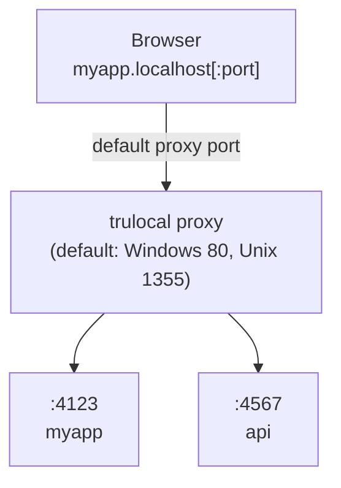

# trulocal

Attribution: trulocal is a rebrand/adaptation of the original portless project by Vercel Labs.

Replace port numbers with stable, named .localhost URLs. For humans and agents.

```diff
- "dev": "next dev"              # http://localhost:3000
+ "dev": "trulocal myapp next dev"  # Windows: http://myapp.localhost | Unix: http://myapp.localhost:1355
```

## Quick Start

```bash
# Install
npm install -g trulocal

# Start the proxy (once, no sudo needed)
trulocal proxy start

# Run your app (auto-starts the proxy if needed)
trulocal myapp next dev
# -> Windows: http://myapp.localhost
# -> macOS/Linux: http://myapp.localhost:1355
```

> The proxy auto-starts when you run an app. You can also start it explicitly with `trulocal proxy start`.

## Why

Local dev with port numbers is fragile:

- **Port conflicts** -- two projects default to the same port and you get `EADDRINUSE`
- **Memorizing ports** -- was the API on 3001 or 8080?
- **Refreshing shows the wrong app** -- stop one server, start another on the same port, and your open tab now shows something completely different
- **Monorepo multiplier** -- every problem above scales with each service in the repo
- **Agents test the wrong port** -- AI coding agents guess or hardcode the wrong port, especially in monorepos
- **Cookie and storage clashes** -- cookies set on `localhost` bleed across apps on different ports; localStorage is lost when ports shift
- **Hardcoded ports in config** -- CORS allowlists, OAuth redirect URIs, and `.env` files all break when ports change
- **Sharing URLs with teammates** -- "what port is that on?" becomes a Slack question
- **Browser history is useless** -- your history for `localhost:3000` is a jumble of unrelated projects

trulocal fixes all of this by giving each dev server a stable, named `.localhost` URL that both humans and agents can rely on.

## Usage

```bash
# Basic
trulocal myapp next dev
# -> Windows: http://myapp.localhost
# -> macOS/Linux: http://myapp.localhost:1355

# Subdomains
trulocal api.myapp pnpm start
# -> Windows: http://api.myapp.localhost
# -> macOS/Linux: http://api.myapp.localhost:1355

trulocal docs.myapp next dev
# -> Windows: http://docs.myapp.localhost
# -> macOS/Linux: http://docs.myapp.localhost:1355
```

### In package.json

```json
{
  "scripts": {
    "dev": "trulocal myapp next dev"
  }
}
```

The proxy auto-starts when you run an app. Or start it explicitly: `trulocal proxy start`.

### Monorepos

For monorepos, you can generate a local script that ensures `trulocal` is used consistently across all apps:

```bash
trulocal init
```

This creates `scripts/trulocal.js`. You can then use it in your `package.json` scripts:

```json
{
  "scripts": {
    "dev:web:trulocal": "node scripts/trulocal.js myapp bun run dev:web"
  }
}
```

## How It Works



1. **Start the proxy** -- auto-starts when you run an app, or start explicitly with `trulocal proxy start`
2. **Run apps** -- `trulocal <name> <command>` assigns a free port and registers with the proxy
3. **Access via URL** -- `http://<name>.localhost` on Windows (default port 80), or `http://<name>.localhost:1355` on macOS/Linux. With `--https`, Windows defaults to port 443 for clean `https://` URLs.

Apps are assigned a random port (4000-4999) via the `PORT` environment variable. Most frameworks (Next.js, Vite, etc.) respect this automatically.

## HTTP/2 + HTTPS

Enable HTTP/2 for faster dev server page loads. Browsers limit HTTP/1.1 to 6 connections per host, which bottlenecks dev servers that serve many unbundled files (Vite, Nuxt, etc.). HTTP/2 multiplexes all requests over a single connection.

```bash
# Start with HTTPS/2 -- generates certs and trusts them automatically
trulocal proxy start --https

# First run prompts for sudo once to add the CA to your system trust store.
# After that, no prompts. No browser warnings.

# Make it permanent (add to .bashrc / .zshrc)
export TRUELOCAL_HTTPS=1
trulocal proxy start    # HTTPS by default now

# Use your own certs (e.g., from mkcert)
trulocal proxy start --cert ./cert.pem --key ./key.pem

# If you skipped sudo on first run, trust the CA later
sudo trulocal trust
```

## Commands

```bash
trulocal <name> <cmd> [args...]  # Run app at http://<name>.localhost (Windows) or :1355 (Unix)
trulocal list                    # Show active routes
trulocal trust                   # Add local CA to system trust store
trulocal init                    # Create a local script for monorepos

# Disable trulocal (run command directly)
TRUELOCAL=0 pnpm dev             # Bypasses proxy, uses default port
# Also accepts TRUELOCAL=skip

# Proxy control
trulocal proxy start             # Start proxy (Windows HTTP: 80, HTTPS: 443; Unix: 1355)
trulocal proxy start --https     # Start with HTTP/2 + TLS (Windows: port 443)
trulocal proxy start -p 80       # Start on port 80 (Unix may require sudo)
trulocal proxy start --foreground  # Start in foreground (for debugging)
trulocal proxy stop              # Stop the proxy

# Options
-p, --port <number>              # Port for the proxy (Windows HTTP:80/HTTPS:443, Unix: 1355)
                                 # On Unix, ports < 1024 require sudo
--https                          # Enable HTTP/2 + TLS with auto-generated certs
--cert <path>                    # Use a custom TLS certificate (implies --https)
--key <path>                     # Use a custom TLS private key (implies --https)
--no-tls                         # Disable HTTPS (overrides TRUELOCAL_HTTPS)
--foreground                     # Run proxy in foreground instead of daemon

# Environment variables
TRUELOCAL_PORT=<number>          # Override the default proxy port
TRUELOCAL_HTTPS=1                # Always enable HTTPS
TRUELOCAL_STATE_DIR=<path>       # Override the state directory
PORTLESS_*                       # Legacy env vars still supported

# Info
trulocal --help                  # Show help
trulocal --version               # Show version
```

## State Directory

trulocal stores its state (routes, PID file, port file) in a directory that depends on the proxy port:

- **Unix (macOS/Linux), Port < 1024** (sudo required): `/tmp/trulocal` -- shared between root and user processes
- **Unix (macOS/Linux), Port >= 1024** (no sudo): `~/.trulocal` -- user-scoped, no root involvement
- **Windows**: `%TEMP%\trulocal` or `%USERPROFILE%\.trulocal` (same logic applies)

Override with `TRUELOCAL_STATE_DIR` (or legacy `PORTLESS_STATE_DIR`) if needed.

## HTTPS Troubleshooting

### One hostname works, another shows "Not private"

If `https://api.myapp.localhost` works but `https://myapp.localhost` shows a privacy warning, the issue is usually hostname/SAN mismatch, stale cert cache, or stale proxy state.

Use this checklist:

```bash
# 1) Restart proxy cleanly
trulocal proxy stop
trulocal proxy start --https

# 2) Inspect served cert for the failing hostname
openssl s_client -connect 127.0.0.1:443 -servername myapp.localhost 2>/dev/null | openssl x509 -noout -subject -ext subjectAltName

# 3) Re-trust the local CA (safe to re-run)
trulocal trust
```

Expected: SAN output includes the exact hostname (for example `DNS:myapp.localhost`).

Implementation detail: trulocal generates per-host SNI certificates for all non-`localhost` hostnames. This avoids browser edge cases with wildcard `*.localhost` matching and applies to any app name.

## Requirements

- Node.js 20+
- macOS, Linux, or Windows 10/11

## Platform Notes

### Windows

- **Default no-port URL**: `trulocal proxy start` listens on port 80 by default, so apps are available as `http://myapp.localhost` (no `:port` suffix). With `--https`, the default switches to port 443 for clean `https://myapp.localhost` URLs.
- **No sudo required**: Windows doesn't enforce privileged port restrictions like Unix systems. Port 80 can be used without Administrator privileges in most cases.
- **Command prompt differences**: Where Unix uses `sudo`, Windows uses "Run as Administrator". Where Unix uses `lsof`, Windows uses `netstat -ano`. Where Unix uses `kill`, Windows uses `taskkill /PID <pid> /F`.
- **Certificate trust**: The `trulocal trust` command uses `certutil` to add the CA to the Windows certificate store. This may prompt for Administrator access.
- **.localhost domains**: Modern browsers (Chrome, Edge, Firefox) on Windows 10/11 natively resolve `.localhost` domains to 127.0.0.1.

### macOS

- **HTTPS certificate trust**: The `trulocal trust` command adds the CA to your login keychain. No sudo required -- the OS shows a GUI authorization prompt.
- **.localhost domains**: `.localhost` domains auto-resolve to 127.0.0.1 on modern macOS.

### Linux

- **HTTPS certificate trust**: The `trulocal trust` command requires sudo to copy the CA to `/usr/local/share/ca-certificates/` and run `update-ca-certificates`.
- **.localhost domains**: `.localhost` domains auto-resolve to 127.0.0.1 on modern Linux distributions.
